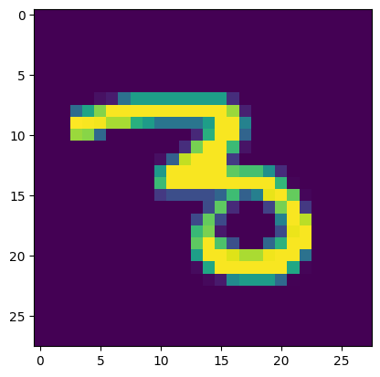
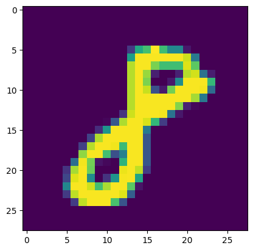
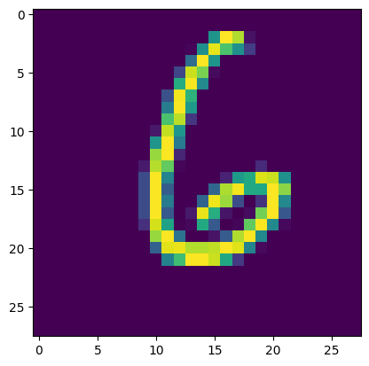
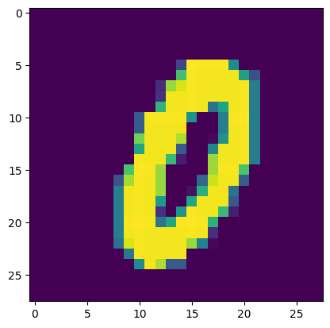

# Apple Pie Neural Network
Super basic multilayer perceptron neural network library built from scratch, *with love*, using only Python and numpy
>  'If you wish to make an apple pie from scratch, you must first invent the universe' 
> -- Carl Sagan

I trained the network on the first 50,000 images of MNIST, and tested it on the last 10,000, and I was able to get ~98% accuracy.


## Demo 
```python
from MNIST import labels, images
from Network import Network

training = images[:50_000]
labels = labels[:50_000]
probe_training = images[50_000:]
probe_labels = labels[50_000:]

nn = Network([784, 40, 40, 10], training=training, labels=labels, probe_training=probe_training, probe_labels=probe_labels)
nn.train(epochs=15, batch_size=15, learning_rate=0.1)
```

    epoch 1/15 - accuracy: 94.04% - loss: 2886.80
    epoch 2/15 - accuracy: 95.78% - loss: 2083.07
    epoch 3/15 - accuracy: 96.65% - loss: 1660.40
    epoch 4/15 - accuracy: 97.13% - loss: 1586.17
    epoch 5/15 - accuracy: 97.50% - loss: 1265.56
    epoch 6/15 - accuracy: 97.86% - loss: 1110.86
    epoch 7/15 - accuracy: 97.80% - loss: 1191.73
    epoch 8/15 - accuracy: 98.21% - loss: 1064.28
    epoch 9/15 - accuracy: 98.00% - loss: 1013.17
    epoch 10/15 - accuracy: 98.55% - loss: 766.64
    epoch 11/15 - accuracy: 97.52% - loss: 1273.52
    epoch 12/15 - accuracy: 98.68% - loss: 728.28
    epoch 13/15 - accuracy: 98.70% - loss: 729.98
    epoch 14/15 - accuracy: 98.77% - loss: 684.22
    epoch 15/15 - accuracy: 98.68% - loss: 747.66


```python
nn.accuracy()
```


    98.68


```python
from matplotlib import pyplot as plt
import numpy as np

for i in range(30, 35):
    img = training[i]
    plt.imshow(np.reshape(img, (28, 28)))
    plt.show()

    print("Digit is:", np.argmax(nn.classify(training[i])))
    print("\n\n")
```


    

    


    Digit is: 3
    
    
    


    

    


    Digit is: 8
    
    
    


    

    


    Digit is: 6
    
    
    


    

    


    Digit is: 9
    
    
    


    

    


    Digit is: 0
    
    
    


